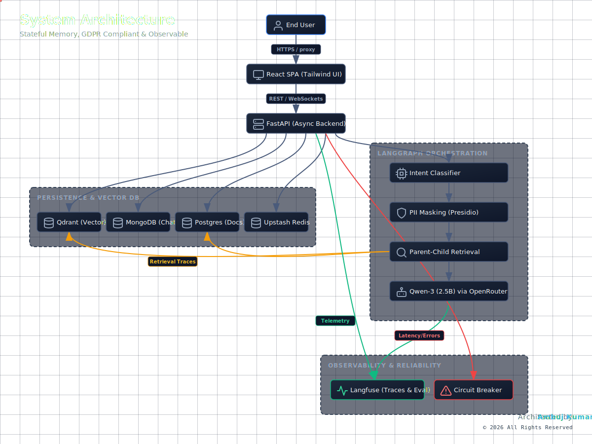

# ⚖️ Indian Legal AI Expert — Enterprise RAG Platform

[](https://fastapi.tiangolo.com)
[](https://reactjs.org)
[](https://github.com/langchain-ai/langgraph)
[](https://qdrant.tech)
[](https://www.docker.com)
[](https://opensource.org/licenses/MIT)

> **A production-grade Sovereign AI assistant designed to provide expert-level legal advisory on the Constitution of India and updated Bharatiya Nyaya Sanhita (BNS) codes.**

---

## 📺 Live Demo
🚀 **[Access the Expert Advisor](https://competitive-elaine-ambuj-ragai-f52aa725.koyeb.app)**

---

## 🏗️ Technical Architecture
The system is built on a modular **Monolith-over-Microservices** architecture, leveraging **LangGraph** for deterministic state-controlled RAG orchestration.
<p align="center">
  
</p>


---

## 🚀 Key Engineering Features

### 🧠 Robust RAG Orchestration
- **LangGraph State Machine**: Deterministic flow control using a 4-node state graph (CLASSIFY → RETRIEVE → GENERATE → POST_PROCESS).
- **Parent-Child Chunking**: Implemented recursive character splitting with Jina AI embeddings. Child chunks (small) optimize vector search retrieval, while parent chunks (contextual) provide the LLM with surrounding knowledge to mitigate hallucinations.
- **Dual Search Strategy**: Hybrid retrieval combining semantic vector search with keyword-based expansion for specific legal terminology (e.g., FIR, BNS Sections).

### 🛡️ Privacy & Reliability
- **PII Masking Integration**: Leverages **Microsoft Presidio + spaCy** to detect and anonymize names, phone numbers, and identifying data before transmission to the LLM.
- **Circuit Breaker Pattern**: Integrated `pybreaker` around external LLM calls (fail_max=10) to ensure system stability during upstream provider outages.
- **Rate Limiting**: IP-based rate limiting (5 req/min) via SlowAPI to prevent API abuse and control operational costs.

### 🔄 Intelligent Sync Engine
- **Automated Re-indexing**: Custom engine using SHA-256 hash comparison between Supabase Storage and a PostgreSQL registry.
- **Orphan Cleanup**: Automatic detection and deletion of vector embeddings for files removed from the knowledge base.
- **Admin Dashboard**: Real-time monitoring of document status (Indexed, Pending, Deleted) with UI-driven sync triggers.

### ⚡ Performance & Observability
- **Three-Tier Caching**: Response caching, active user tracking, and stream simulation via **Upstash Redis**.
- **Observability**: Real-time tracing of every user intent and LLM inference chain using **Langfuse**.
- **GDPR Compliance**: MongoDB-backed chat history with automatic 30-day TTL index for data-at-rest protection.

---

## 🛠️ Tech Stack

- **Frontend**: React 18, Tailwind CSS (Glassmorphism UI), Lucide Icons
- **Backend**: FastAPI, Uvicorn, LangChain, LangGraph, Pydantic
- **AI Models**: Qwen 3 235B (via OpenRouter), Jina AI Embeddings v2
- **Infrastructure**: Docker, Koyeb (Compute), Qdrant Cloud (Vector Store), MongoDB Atlas (NoSQL), Supabase (Postgres + Object Storage), Upstash (Redis)

---

## 💻 Local Development

1. **Clone the repository**:
   ```bash
   git clone https://github.com/Ambuj123-lab/indian-legal-ai-expert.git
   cd indian-legal-ai-expert
   ```

2. **Backend Setup**:
   ```bash
   cd backend
   python -m venv venv
   source venv/bin/activate  # Or venv\Scripts\activate
   pip install -r requirements.txt
   ```

3. **Frontend Setup**:
   ```bash
   cd frontend
   npm install
   ```

4. **Environment Variables**:
   Create a `.env` file in the root using `.env.example` as a template.

---

## ⚖️ Disclaimer
*This application is an AI-powered educational tool designed to assist with legal research. It does not constitute legal advice. Users should consult a qualified legal professional for critical matters.*

---

**Developed with ❤️ by [Ambuj Kumar Tripathi](https://github.com/Ambuj123-lab)**
